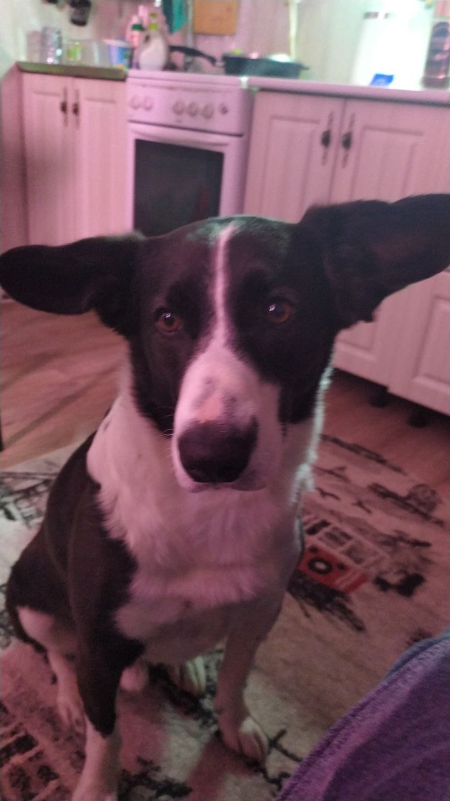
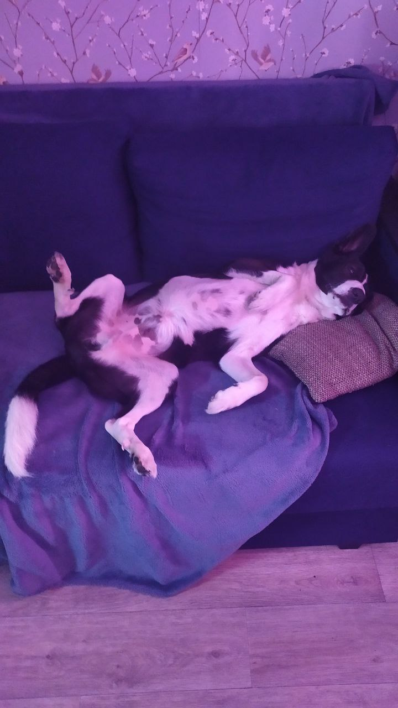
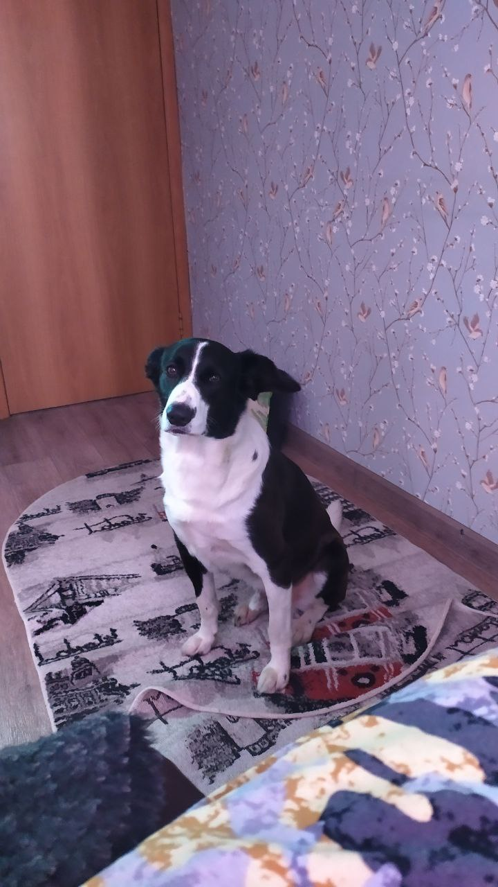

# Знакомство с Александром Киселевым, он же Nobiys

Приветствую тебя, читатель моего странного блога. Почему он странный? Потому что никто не ведет блоги на GitHub (я на это надеюсь). 

Мне 28 лет, живу я в прекрасном городе Екатеринбург. Говорят, что на Урале живут суровые люди, но это не так, мы тут выживаем. Шутка, все у нас хорошо. 

Что бы мне рассказать о себе? Женат, детей нет, но есть собака, которая ведет себя как ребенок. Зовут пса Барон, кличка полностью оправдывает поведение. Изначально пес был так назван в честь пса Барона из сериала "Счастливы вместе", который снимался в Екатеринбурге. Раньше было забавно наблюдать за главным персонажем, но с каждым годом я все лучше и лучше понимаю Геннадия.

А вообще по профессии я лаборант в лаборатории квантовой магнитометрии физико технического факультета, но давайте не будем отдаляться от темы. В качестве хобби я стримлю игры на протяжении уже трех лет. Поэтому я немного владею программой photoshop и могу сделать там забавные картинки. 

Фотографироваться сейчас я не особо планирую, но зато я с удовольствием могу приложить фото своего пса!

Если что, фотографии я свои не скрываю, не переживайте. Так как я стример, меня всегда можно найти в интернете на площадках рутуба, дзена и (о боже), даже ютуба.

Хорошего дня, надеюсь вам понравилось читать мой блог!
